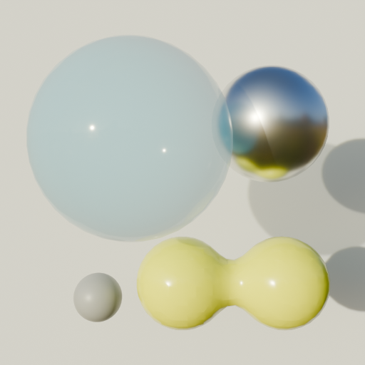

# pmse-logo

pmse (忆苦引擎)

正式名称: `紫腹巨蚊` (Toxorhynchites gravelyi) 系列 `表皮葡萄球菌`
(Staphylococcus epidermidis) 引擎

## 图标草图

pmse 图标名称: **"小宇宙" 1+4**

主要构图:

| 序号 | 位置 | 描述     | 材质                          | z 轴位置 | 备注 |
| :--: | :--- | :------- | :---------------------------- | :------- | :--- |
|  1   | 左上 | 大圆球   | 玻璃材质                      | 前       |      |
|  2   | 左下 | 小圆球   | 岩石材质                      | 后       |      |
|  3   | 右上 | 中圆球   | 金属材质 (高金属度, 低粗糙度) | 中       |      |
|  4   | 右下 | 连体圆球 | 彩色塑料材质 (左紫右黄)       | 后       |      |

## blender 3D 渲染

(后续可继续升级画质, 提升细节)

TODO
